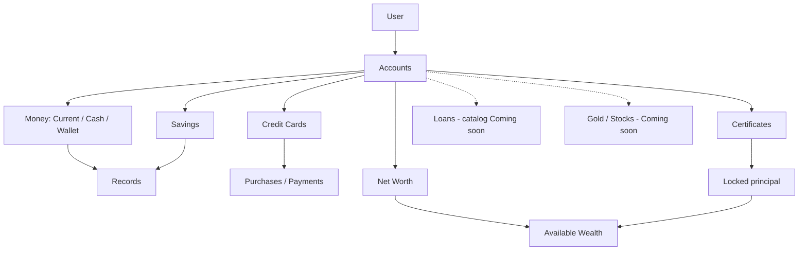
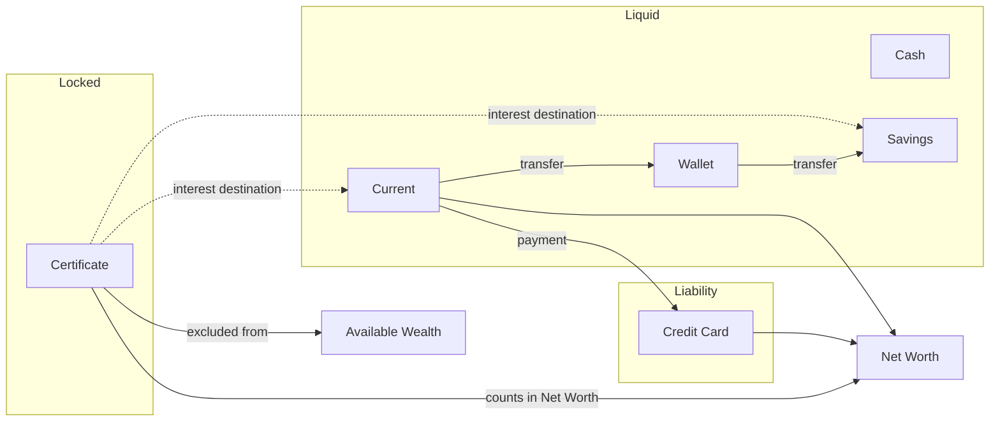
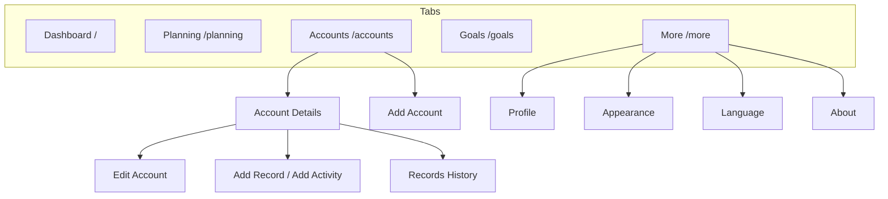
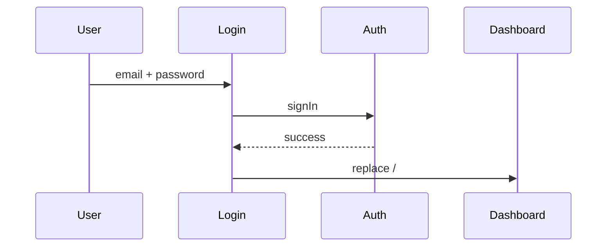
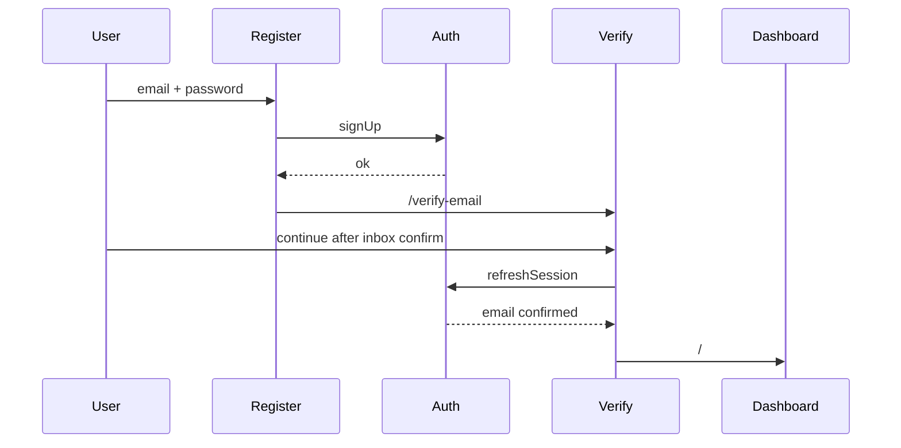
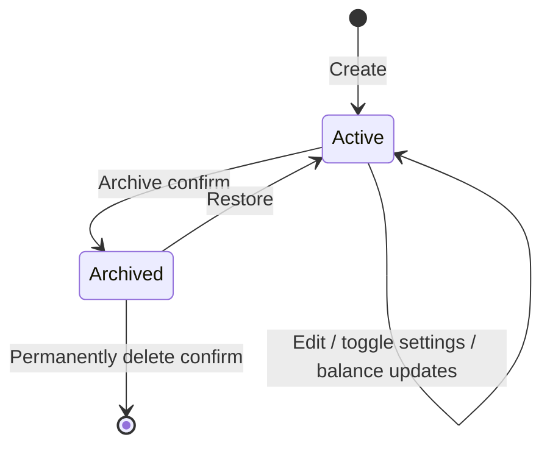

# NUME Product Specification v2.0 — As Implemented

**Status:** Product source of truth  
**Baseline:** Product as shipped (`ab1da6e` and equivalent production)  
**Audience:** Product Managers, Product Designers, Engineers  
**Purpose:** Someone new to NUME should be able to understand and rebuild the product from this document alone—without the original MVP PRD and without reading code.

This specification describes **what NUME is today**, **why it behaves this way**, and **the rules that govern major behavior**.  
Where earlier product intent conflicted with shipping decisions, **this document follows the implemented product**.

---

## Table of contents

1. [Product vision](#1-product-vision)
2. [MVP scope](#2-mvp-scope)
3. [Product principles](#3-product-principles)
4. [Core terminology](#4-core-terminology)
5. [Product philosophies](#5-product-philosophies)
6. [Financial engine](#6-financial-engine)
7. [Navigation & information architecture](#7-navigation--information-architecture)
8. [Cross-module behavior](#8-cross-module-behavior)
9. [Global interaction patterns](#9-global-interaction-patterns)
10. [Module: Authentication](#10-module-authentication)
11. [Module: Dashboard](#11-module-dashboard)
12. [Module: Planning](#12-module-planning--stub)
13. [Module: Accounts](#13-module-accounts)
14. [Module: Records](#14-module-records)
15. [Module: Goals](#15-module-goals--stub)
16. [Module: More](#16-module-more)
17. [Not implemented (explicit)](#17-not-implemented-explicit)
18. [Future extensibility](#18-future-extensibility)
19. [Appendix: route map](#19-appendix-route-map)

---

## 1) Product vision

NUME is a **personal wealth operating system** for people who hold money across banks, cash, wallets, savings, certificates, and credit products—especially in an Egyptian financial context.

NUME’s job today is to help a person:

1. **See** their overall financial position clearly (Net Worth)
2. **Hold** an accurate picture of where money lives (Accounts + Current Balance)
3. **Record** how money moves when it matters (Records / credit activity)
4. **Prepare** for deeper planning and goal-setting without pretending those modules are finished (Planning & Goals stubs)

NUME is **wealth-first**, not expense-first. It models how people actually hold and move money—not a bookkeeping ledger.

---

## 2) MVP scope

### 2.1 In scope (shipped)

| Area | What’s live |
|---|---|
| **Authentication** | Sign in, sign up, email verification, password reset, sign out, session expiry notice |
| **Dashboard** | Net Worth, setup guidance (zero accounts), certificates maturing soon, educational widgets, recent activity, pull-to-refresh |
| **Accounts** | List (active/archived), type picker, create/edit/details for shipped types, archive/restore/delete, wealth toggles |
| **Money accounts** | Current, Cash, Wallet |
| **Savings** | Savings accounts with interest configuration |
| **Certificates** | Certificate accounts with schedule/expectations and maturity insight |
| **Credit cards** | Credit cards with purchase/payment activity |
| **Loans** | Present in catalog as *Coming soon* (not creatable) |
| **Records** | Income, expense, transfer, adjustment on supported account types; month history |
| **More** | Profile stub, Appearance (theme), Language (EN/AR), About, Logout |
| **Shell** | Tab bar, stack navigation, splash, toasts, offline UX, i18n/RTL shell |

### 2.2 Stub modules (shipped intentionally incomplete)

- **Planning** — orientation empty state only
- **Goals** — orientation empty state only
- **Profile** — email display + “coming later” stub copy

### 2.3 Explicitly out of scope today

- Notifications center / push notification rules
- Family / shared finances
- Budgeting, monthly expense modeling UI, goal funding UI
- Institution catalog management in Settings
- Multi-currency
- Auto-apply certificate/savings interest automation as a finished payout engine UI
- Gold and Stocks (catalog cards exist as *Coming soon* only)

---

## 3) Product principles

| Principle | Meaning in NUME |
|---|---|
| **Accounts are the source of truth** | Balances and inclusion flags define wealth. Records update balances; they do not replace them. |
| **Wealth-first** | Account types reflect how Egyptians hold wealth (cash, wallets, bank accounts, certificates, credit). |
| **Progressive disclosure** | Ship readable configure/view flows before unfinished automation. Do not expose broken futures as live UI. |
| **Finance-native language** | Copy uses product terminology and Foundation writing patterns—not marketing headlines. |
| **One product voice EN + AR** | Every user-facing string lives in i18n. RTL is a first-class layout concern. |
| **Calm operational UI** | Confirmations for consequence; toasts for outcomes; no success screens. |
| **Mobile-first app shell** | Constrained width, bottom tabs on roots, stack screens for deep work, 44×44 touch minimum. |

---

## 4) Core terminology

Approved product concepts and interface wording are governed by Foundation documents—**not duplicated here**:

- `docs/PRODUCT-TERMINOLOGY.md` — product concepts
- `docs/WRITING-PATTERNS.md` — labels, empty states, confirmations, situational copy
- `docs/FOUNDATION.md` — frozen interaction/building-block foundations
- `docs/CONTENT.md` — mechanical copy rules (sentence case, punctuation)
- `docs/CONTENT-DESIGN-FOUNDATION.md` — ownership & precedence map

This specification uses those terms as the user experiences them (e.g. **Net Worth**, **Archive**, **Delete**, **Income**, **Expense**, **Add account**).

---

## 5) Product philosophies

These are product decisions. They explain *why* NUME behaves the way it does.

### 5.1 Why balances are the source of truth

**Problem:** If wealth were reconstructed only from historical records, any missing, late, or never-imported transaction would corrupt Net Worth forever.

**Decision:** Each account stores a **Current Balance**. Net Worth reads balances (and inclusion flags), not a full replay of records.

**Implication:** Users can create an account with today’s balance and get a useful wealth picture immediately—even with zero records.

### 5.2 Why records are an interaction / audit layer

**Problem:** Users still need a trustworthy way to explain *what changed* and to update balances after real activity.

**Decision:** Records (income, expense, transfer, adjustment, and credit activity) are the user-facing way to change balances and leave an audit trail. The balance field remains authoritative.

**Implication:** Recording an expense decreases Current Balance; it does not become the only definition of that account’s value.

### 5.3 Why Current Balance is not reconstructed from records

Reconstructing balances from records would require perfect history, correct opening balances, and continuous completeness. NUME rejects that dependency.  
**Adjustments** exist specifically to reconcile “bank/app truth” with NUME without inventing fake history.

### 5.4 Why archive exists

**Problem:** Accounts stop being relevant (closed accounts, finished certificates, old cards) but users still need records and historical truth.

**Decision:** **Archive** removes an account from active views and Net Worth participation (active Net Worth only includes active accounts; archive also turns off Net Worth inclusion), while **preserving records**.

**Implication:** Archive is reversible via **Restore**.

### 5.5 Why permanent delete is restricted

**Problem:** Accidental irreversible deletion destroys audit trail and wealth history.

**Decision:** Permanent delete requires confirmation, removes the account and associated records completely, and is available primarily from archived surfaces. It is a last resort—not everyday cleanup.

### 5.6 Why Planning and Goals are stubs

**Problem:** Leaving those tabs empty, broken, or “Coming soon” signals unfinished product poorly.

**Decision:** Ship intentional stub empty states that establish the mental model and, when useful, send users to add a first account. Do not expose budgeting/goal engines before they’re ready.

**Implication:** CTA appears only when the user has **no accounts**. With accounts present, title/body remain; CTA hides.

### 5.7 Why educational Dashboard widgets exist before their engines

**Decision:** Widgets for Financial Health, Emergency Fund, Cash Flow, and Goals establish future value without implying live scores or fake data. They are educational placeholders, not disabled features.

---

## 6) Financial engine

This chapter is NUME’s financial model as shipped.

### 6.1 Entity model (conceptual)



### 6.2 Current Balance

| Rule | Detail |
|---|---|
| **Definition** | The amount currently held (or owed, for liabilities) on an account |
| **Authority** | Stored on the account; updated by user actions and product flows |
| **Create** | Opening balance is set at account creation |
| **Direct edit** | Supported on eligible detail screens (e.g. money/savings quick balance) |
| **Via records** | Income increases; expense decreases; transfer moves between accounts; adjustment sets to a correct balance and stores a delta audit |
| **Certificates** | Balance equals principal; interest does not inflate certificate balance |
| **Credit cards** | Balance reflects outstanding debt; UI may display as outstanding balance |

### 6.3 Net Worth

**Objective:** Show the user’s overall financial position in one number.

**Formula (as implemented):**

```text
Assets      = sum of max(currentBalance, 0) for active accounts with includeInNetWorth = ON
Liabilities = sum of max(-currentBalance, 0) for active accounts with includeInNetWorth = ON
Net Worth   = Assets − Liabilities
```

**Rules:**

| Rule | Detail |
|---|---|
| Only **active** accounts participate | Archived accounts are excluded |
| Account must have **Include in Net Worth** on | Toggleable in settings where exposed |
| Positive balances contribute as assets | |
| Negative balances contribute as liabilities | Credit cards/loans held as negative wealth reduction |
| Currency | EGP only |

**User problem solved:** “What am I worth, given everything I hold and owe?”

### 6.4 Available Wealth

**Objective:** Measure wealth that is conceptualy usable for spending / future goal funding—not locked principal.

**Formula (as implemented):**

```text
Available Wealth =
  Net Worth
  − Required Emergency Fund   (0 until Planning ships)
  − Locked Certificate Principal
```

**Locked Certificate Principal** = sum of balances for active certificate accounts that are included in Net Worth (and not archived at certificate config level).

**Decision rationale:** Certificates can inflate Net Worth without being spendable. Available Wealth keeps goal/planning philosophy honest even though Goals UI is still a stub.

**Constraint today:** Available Wealth is computed in the finance model and not yet a primary Dashboard metric UI.

### 6.5 Account capability matrix

| Type | Creatable | Net Worth | Available Wealth | Records / transfers | Interest destination eligible | Notes |
|---|---|---|---|---|---|---|
| Current | Yes | Yes (if included) | Yes | Yes | Yes | Liquid settlement account |
| Cash | Yes | Yes | Yes | Yes | Yes | Institution optional |
| Wallet | Yes | Yes | Yes | Yes | Yes | Liquid |
| Savings | Yes | Yes | Yes (not locked like certificates) | Yes | Yes | Interest config exists |
| Certificate | Yes | Yes | **No** (locked principal) | No manual income/expense | No | Principal locked; educational schedule |
| Credit card | Yes | Yes (as liability) | No | Activity: purchase/payment | No | Not transfer destination |
| Loan | No (Coming soon) | — | — | — | — | Catalog only |
| Gold / Stocks | No (Coming soon) | — | — | — | — | Catalog only |

**Transfer / destination rule:** Only active **Current, Cash, Wallet, Savings** accounts may send/receive transfers and appear as interest or transfer destinations.

### 6.6 Money accounts (Current, Cash, Wallet)

**Objective:** Represent liquid holdings for day-to-day money.

**Rules:**

- Full records flow: income, expense, transfer
- Cash typically has no institution; Current/Wallet may
- Current supports optional last-4 identifier
- Default: included in Net Worth; emergency fund inclusion starts off unless set

### 6.7 Savings

**Objective:** Represent interest-bearing saved money with interest configuration (model, rate/tiers, posting, destination).

**Rules:**

- Transaction-capable like money accounts
- May receive interest into self or another eligible destination account
- Opening balance required on create
- Interest posting automation may process due interest; educational schedule can exist without pretending every bank product is automated

### 6.8 Certificates

**Objective:** Represent fixed-term deposits (Egyptian CD-like products).

**Key product decisions:**

| Decision | Rule |
|---|---|
| Two-layer model | Account row (balance, flags, status) + certificate configuration (term, rate, schedule, destination) |
| Balance | Always equals principal |
| Interest | Does not increase certificate balance; paid/expected to a destination |
| Net Worth | Principal included when `includeInNetWorth` ON |
| Available Wealth | Principal excluded (locked) |
| Records | No manual “Add income/expense” flow on certificate |
| Maturity | Manual lifecycle; dashboard can surface “maturing soon” |
| Auto-apply automation | Not a finished user-facing automation product in v1 |

**Why:** Certificates are wealth holdings, not checking accounts. Modeling them as income streams would distort Available Wealth and Spending logic.

### 6.9 Credit cards

**Objective:** Track revolving credit: outstanding balance, limit concepts, purchases, and payments from liquid accounts.

**Rules:**

- Purchases increase debt (credit activity)
- Payments decrease debt and decrease the source liquid account
- Manual income/expense record flow is blocked
- Add Activity sheet is the primary interaction model
- Payment source must be a transfer-capable account

### 6.10 Loans

**Objective (future):** Liability accounts for borrowed money repaid over time.

**Today:** Shown in the Add Account picker as **Coming soon** (not creatable). Treat as reserved IA, not a live module.

### 6.11 How money types interact



---

## 7) Navigation & information architecture

### 7.1 Primary map



### 7.2 Rules

- Five tab roots are peers (replace navigation), not a nested stack between themselves.
- Stack screens hide the tab bar and show back.
- Returning to Accounts restores the persisted Active/Archived filter.
- Auth routes live outside the app shell.

---

## 8) Cross-module behavior

### 8.1 Dashboard ← Accounts

- Zero accounts → setup banner + Add account CTA on Net Worth card
- Net Worth recomputes from active included accounts
- Certificate maturity section appears only when certificate insights exist
- Tapping maturity rows / activity rows opens related accounts

### 8.2 Dashboard ← Records

- Recent Activity lists recent records (limited count)
- Section hidden when no records exist
- Row opens the owning account (not a record detail route)

### 8.3 Planning ← Accounts / Goals ← Accounts

- Stub CTAs appear only when `accounts.length === 0`
- Both route to first-account create (`/accounts/new`)

### 8.4 Certificates ← Dashboard

- “Certificates maturing soon” is a Dashboard insight derived from certificate maturity data
- Auto-renewal badge appears when renewal is not `none`

### 8.5 Refresh across modules

- Pull-to-refresh reloads finance data through the shared finance store
- Offline pull cancels refresh and signals offline toast
- Finance load errors surface differently by surface:
  - Dashboard Net Worth: inline error copy
  - Accounts / several stack screens: refresh error notice + retry
  - Planning / Goals: inline “Unable to refresh” (stub)

### 8.6 More ← Auth

- Logout signs out and returns to login
- Profile shows authenticated email

---

## 9) Global interaction patterns

### 9.1 Pull-to-refresh

- Available on many list/root screens and some stack screens
- Threshold-based gesture; visual hold while refreshing
- Offline: cancel + persistent offline toast

### 9.2 Offline

| State | UX |
|---|---|
| Offline | Persistent warning toast: “You’re offline” / “Some features may not be available” |
| Back online | Dismiss offline toast; short success: “You’re back online.” |

### 9.3 Loading

- Skeletons for meaningful first paint (Dashboard Net Worth, Accounts list, some stack shells)
- Progressive button labels while submitting (“Signing in…”, “Creating account”, “Saving…”)

### 9.4 Empty states

Three layers (product model):

1. **Title** — What kind of place is this?
2. **Body** — Why does it matter / what can I do?
3. **CTA** — What next? (only when a next action is appropriate)

### 9.5 Confirmations

- Used for archive, permanent delete, discard unsaved changes
- Include consequence description
- Loading confirm labels while mutative action runs

### 9.6 Validation

- Field-adjacent and form-level errors
- Many required fields use Enter/Select imperatives rather than “{Field} is required”

### 9.7 Success feedback

- Toast + navigate (no dedicated success screens)
- Examples: Account created, Account updated, Income recorded, Purchase recorded

### 9.8 Localization & RTL

- EN and AR catalogs
- Changing language restarts into a consistent direction/font shell
- Logical CSS (start/end) for RTL

### 9.9 Accessibility (current)

- Tab landmark labeled “Main navigation”
- Explicit button labels; foundation components standardize interactive rows and sheets
- Touch targets aim for 44×44 minimum

### 9.10 Design system conventions

UI must consume frozen foundations (headers, pickers, account details chrome, confirm sheets, editable fields, card surfaces). See `docs/FOUNDATION.md`.

---

## 10) Module: Authentication

### Product objective
Establish a secure personal session so wealth data is private and portable across devices.

### User problem
Without auth, wealth data cannot safely belong to a person. Without verification/reset, access recovery breaks.

### Entry points
- Direct routes: `/login`, `/register`, `/verify-email`, `/forgot-password`, `/reset-password`
- Email magic links → `/auth/callback` then next destination
- Session expiry can land user on login with a notice

### User goals
Sign in · Create account · Verify email · Reset password · Sign out

### Happy paths

**Sign in**



**Sign up → verify → enter app**



### Alternate paths
- Invalid credentials → inline error
- Email already in use → inline error
- Weak password → inline error
- Callback failure → login with callback error message
- Unexpected sign-out → session expired notice on next login

### Empty / loading / success / error
- Forms always present (no empty state)
- Loading via progressive button labels
- Success mostly via navigation (+ optional notice like “Password updated”)
- Errors inline in destructive text

### Validation
- Email required / valid
- Password required; min length 8 on register/reset

### Business rules
- Email verification flow uses app URL redirects
- Missing auth configuration surfaces configuration error copy

### Exit points
- Successful sign in → Dashboard
- Sign out (verify or More) → Login

### Dependencies
Auth provider + configured backend; no finance data required

---

## 11) Module: Dashboard

### Product objective
Give a daily overview: wealth position now, relevant upcoming certificate pressure, and guidance toward fuller NUME use.

### User problem
People can’t feel in control of finances without a single place that answers “where do I stand?” and “what needs attention?”

### Entry points
- Tab: Dashboard `/`
- Default post-login destination

### User goals
Read Net Worth · start first account · notice certificates maturing · browse activity · refresh

### Happy path (with accounts)

1. Open Dashboard  
2. See Net Worth card (amount, assets · liabilities, updated meta)  
3. Optionally see certificates maturing soon  
4. See educational widgets  
5. If records exist, see Recent Activity and open an account  

### Alternate paths
- **Zero accounts:** setup banner + Net Worth CTA → `/accounts/new`
- **No records:** activity section omitted
- **No maturing certificates:** maturity section omitted

### Empty / loading / success / error
| State | Behavior |
|---|---|
| Empty (zero accounts) | Setup banner + Add account CTA |
| Loading | Net Worth skeletons |
| Success | Metrics + optional sections |
| Error | Net Worth inline load error |

### Business rules
- Recent Activity is capped (small number of rows)
- Educational widgets always show (not gated on data)
- Maturity labels use singular/plural day strings

### Edge cases / constraints
- Pull-to-refresh offline → offline toast, no refresh
- Activity opens accounts, not a dedicated record route

### Dependencies
Accounts, certificates insights, records; finance refresh

---

## 12) Module: Planning — Stub

### Product objective
Reserve the Planning destination and communicate future monthly income/expense planning without shipping an unfinished budget engine.

### User problem
Users expecting “plans” need orientation—not a blank or broken screen.

### Entry points
Tab `/planning`

### Current behavior only

| Element | Behavior |
|---|---|
| Title / body | Stub orientation empty state (always) |
| CTA | “Start with your first account” only if zero accounts |
| Error | Inline unable-to-refresh on finance load error |
| Refresh | Pull-to-refresh supported |

### Decision rationale
See §5.6.

### Exit points
CTA → `/accounts/new`

### Future extensibility
When Planning ships, preserve the tab and upgrade content; Available Wealth / emergency fund calculations should plug into this module carefully.

---

## 13) Module: Accounts

### Product objective
Be the system of record for everything the user owns or owes that NUME models.

### User problem
Wealth is fragmented across banks, cash, wallets, savings, certificates, and credit. Users need one place that mirrors reality.

### Entry points
- Tab `/accounts`
- Dashboard setup / Add account CTAs
- Planning/Goals stub CTAs
- Deep links to account details, create, edit, records, activity

### User goals
Browse · create · inspect · edit · record activity · archive/restore/delete · refresh

### Accounts list — happy path

1. Open Accounts  
2. Filter Active (default) or Archived  
3. Browse grouped sections: Money, Savings, Certificates, Liabilities  
4. Open an account card  

### Alternate paths

| Condition | Behavior |
|---|---|
| Active + no active accounts | Empty state + CTA to first account; header Add hidden |
| Archived empty | Empty archived copy; no create CTA |
| Has accounts | Header Add opens type picker sheet |
| Type Coming soon | Card shown but not selectable |

### Account lifecycle



| Action | Effect |
|---|---|
| **Archive** | Status archived; Net Worth inclusion forced off; leaves active views; records preserved |
| **Restore** | Status active again |
| **Permanently delete** | Hard removal of account (and records); irreversible; after confirmation |

### Create — happy path

1. Choose type (or first-account current flow)  
2. Enter fields (type-specific)  
3. Create account  
4. Toast + land on details  

**First-account special case:** `/accounts/new` uses Current with first-account title/lead and **Continue** CTA instead of the normal create wording.

### Details — by family

| Family | Notable behavior |
|---|---|
| Money | Balance card (editable when active), Add Record, settings toggles, edit/archive |
| Savings | Interest summary surfaces + record flow like money |
| Certificate | Principal/config display, archive confirm wording about preserved records; no Add Record income/expense |
| Credit card | Outstanding balance framing; Add Activity for purchase/payment |

### Validation (high level)
- Required names and balances
- Institution select where required
- Optional identifiers constrained to 4 digits when present
- Duplicate identity protections for certain combinations

### Edge cases
- Unknown create type → unavailable message + Back to accounts
- Missing account id → not found surfaces
- Finance not ready → skeletons

### Dependencies
Finance store; institution pickers; records/activity modules; confirmations; refresh/error surfaces

---

## 14) Module: Records

### Product objective
Give a consistent way to move/update balances with an explainable audit trail on transaction-capable accounts.

### User problem
Without a lightweight activity model, balances become mysterious and stale.

### Entry points
- Add Record from money/savings details
- `/accounts/{id}/records/new` and typed form routes
- History via Recent Records → View all / `/accounts/{id}/records`

### Supported record types

| Type | Effect on Current Balance |
|---|---|
| Income | Increases |
| Expense | Decreases |
| Transfer | Decreases source, increases destination (two records) |
| Adjustment | Sets balance to entered correct balance; stores delta amount as audit |

Credit purchases/payments are **activity** records (see Credit Cards), not the income/expense picker.

### Happy path

1. Choose type (income/expense/transfer)  
2. Fill amount, optional description, date (+ destinations for transfer)  
3. Save → toast → return to details  

### Alternate / blocked paths
- Credit card / certificate → unsupported manual records message
- Transfer blocked unless accounts are transfer-capable and distinct

### Validation
- Amount required / valid / non-zero where applicable
- Date required, not future (where enforced)
- Transfer requires from/to
- Adjustment rejects “no change” when correct balance equals current

### History
- Filter chips: This month / Last month
- Empty month shows empty state

### Exit points
Back to details; success replace to details

---

## 15) Module: Goals — Stub

### Product objective
Reserve Goals as the place for financial targets and progress—without shipping goal funding logic early.

### Behavior
Symmetric with Planning stub: always-empty orientation, CTA only with zero accounts, refresh + error line, CTA → `/accounts/new`.

### Philosophy
Goals will consume **Available Wealth**, not raw Net Worth (locked certificates must not fund goals). That rule is established now even though Goals UI is stubbed.

---

## 16) Module: More

### Product objective
Provide lightweight personal and app settings without becoming a second product.

### Entry: `/more`

| Destination | Behavior |
|---|---|
| Profile | Shows email + stub message that editing comes later |
| Appearance | System / Light / Dark theme preference |
| Language | English / Arabic; changing triggers locale restart |
| About | Brand, product description, version string |
| Logout | Sign out → login |

### Entry / exit
- Stack destinations use back
- Logout exits authenticated shell

### Constraints
No Notifications settings, no Family, no Institution admin, no deep profile editing.

---

## 17) Not implemented (explicit)

Documented so future work doesn’t accidentally claim them:

| Area | Status |
|---|---|
| Notifications center | Not implemented (only connectivity/success/error toasts) |
| Family | Not implemented |
| Loan create/details product | Catalog Coming soon only |
| Gold / Stocks | Catalog Coming soon only |
| Goal funding / progress tracking UI | Stub only |
| Planning engine UI | Stub only |
| Multi-currency | Not implemented |
| Institution management in Settings | Not implemented |

---

## 18) Future extensibility

When extending NUME:

1. **Declare the account type** in the capability matrix (Net Worth, Available Wealth, transfer, destination, records).
2. Prefer shared destination/transfer rules over new hardcoded type lists.
3. Keep balances as source of truth.
4. Prefer Archive over Delete for reversible exit.
5. Don’t ship partial engines as interactive truth—stub or educate first.
6. Update this specification when product behavior changes.

---

## 19) Appendix: route map

### Auth
`/login` · `/register` · `/verify-email` · `/forgot-password` · `/reset-password` · `/auth/callback`

### Tabs
`/` · `/planning` · `/accounts` · `/goals` · `/more`

### Accounts
`/accounts/new` · `/accounts/new/[type]` · `/accounts/[id]` · `/accounts/[id]/edit`  
`/accounts/[id]/records` · `/accounts/[id]/records/new` · `/accounts/[id]/records/new/[type]`  
`/accounts/[id]/activity/new` · `.../purchase` · `.../payment`

### More
`/more/profile` · `/more/appearance` · `/more/language` · `/more/about`

---

## Document control

| Field | Value |
|---|---|
| Spec version | 2.0 As Implemented |
| Supersedes | Original MVP PRD as operational product truth for shipped behavior |
| Change policy | Update this document when product behavior changes—not only when UI is redesigned |
